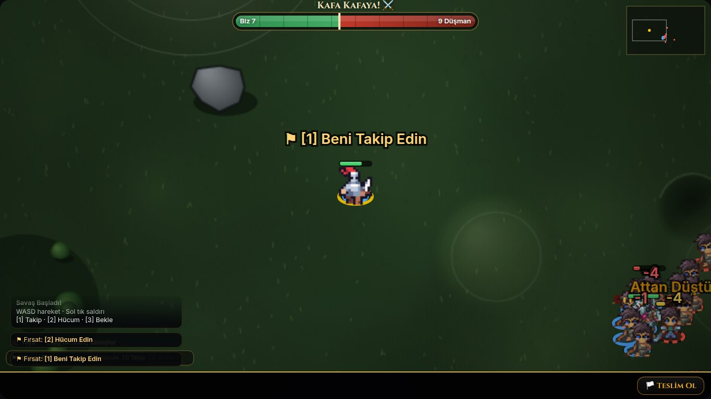
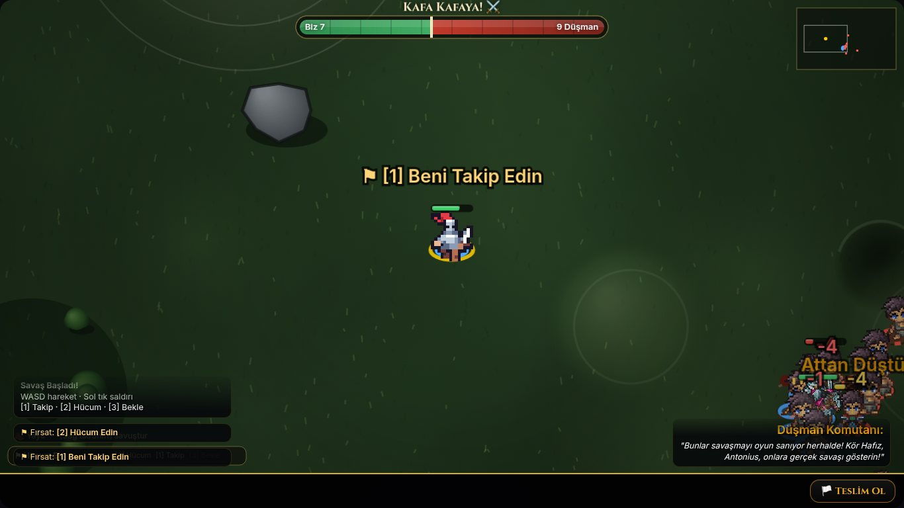
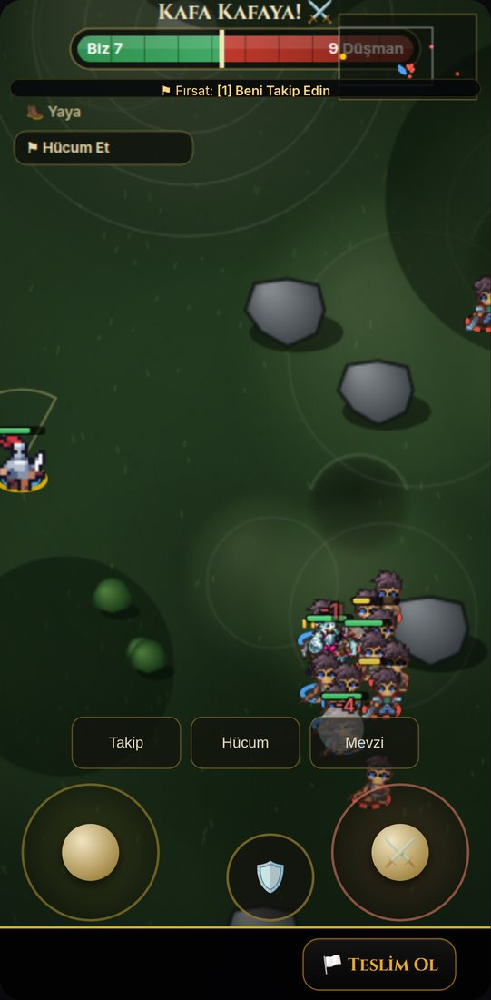
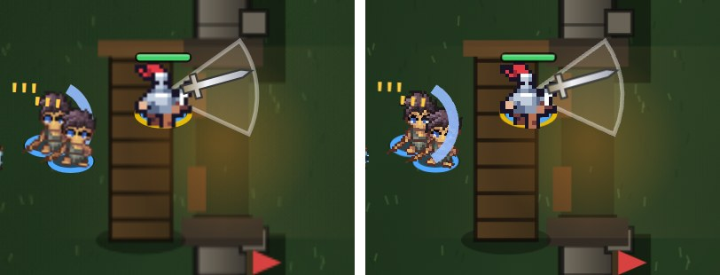
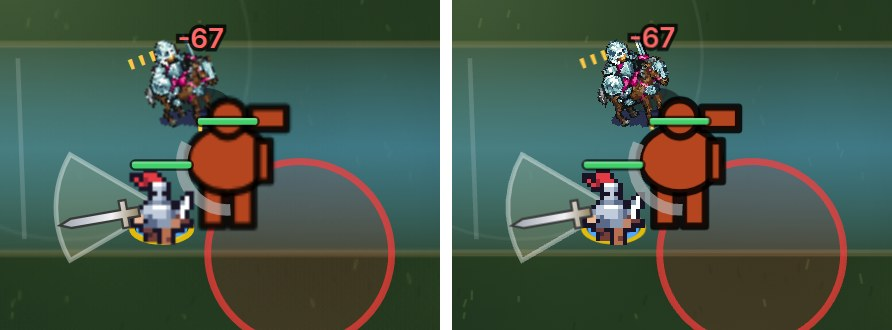

# Battle renderer: Canvas2D vs PixiJS 8 (1.33.0)

Same battle, frozen mid-fight (`Battle.paused = true`, fixed dice via a seeded `Math.random`,
`performance.now` pinned so every clock-driven wave, pulse and bob is at the same phase), drawn
first by Canvas2D and then by PixiJS from the very same state. Headless Chromium 1194
(SwiftShader WebGL), Playwright projects `tr-desktop` (1366×768, DPR 1) and `tr-phone`
(Pixel 7: 412×915, DPR 2.625).

## Screenshots

| | Canvas2D | PixiJS |
|---|---|---|
| Desktop |  |  |
| Phone (half size) |  |  |

Close-ups, Canvas2D left, PixiJS right:

- desktop melee, 2× nearest: 
- phone melee, 1:1 device pixels: 
- siege gate (wall, tower, boiling oil, sword sweep, shield arc): 
- boss (hand-drawn art, telegraph, water shimmer): 

The pictures match — same poses, rings, bars, damage text, HUD, minimap. The visible
differences are the intended one (crisper: pixel art sampled `nearest` at device resolution,
ground baked at up to 3×) and the layer order (Pixi draws all shadows, then all rings, then all
bodies… so a health bar is never covered by the unit in front of it).

## CPU per drawn frame

From `Debug.report().render.battleRenderer` (smoothed `update` / `render` ms), 8 s into a live
battle, desktop viewport:

| Renderer | 10 v 10 | 30 v 30 | Draw calls | fps |
|---|---|---|---|---|
| Canvas2D | 0.24 / 1.06 ms | 0.52 / 1.60 ms | — | 60 |
| PixiJS (forced, SwiftShader) | 0.45 / 2.36 ms | 0.41 / 2.39 ms | 5–7 | 8–10 |

Phone viewport, PixiJS at 2.625×: 0.47 / 2.71 ms (10 v 10), 1.08 / 5.78 ms (30 v 30).

SwiftShader is a software rasterizer: WebGL there is ~10× slower than Chromium's CPU Canvas2D,
so the frame rate is bound by the rasterizer, not the JS above. That is why `'auto'` keeps a
software WebGL (`Game.webgl().soft`) on Canvas2D. MSAA was not the cause (off: 10 fps).

**Still to be done: real-device numbers** (iPhone, a mid-range Android, a desktop GPU). The
earlier POC measured 60 fps with no jank for both paths on an iPhone 14 up to 250 v 250.
